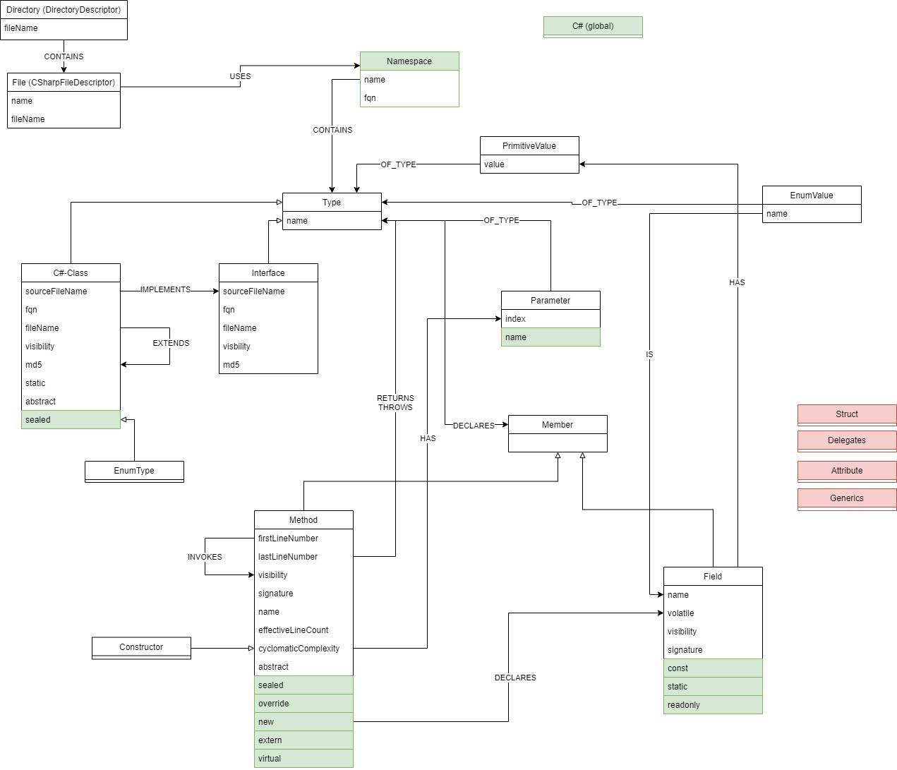

# jQAssistant C# Plugin

[](LICENSE)
[](https://travis-ci.com/softvis-research/jqa-csharp-plugin)

This is a **C#** parser for [jQAssistant](https://jqassistant.org/). 
It enables jQAssistant to scan and to analyze **C#** files.

## Getting Started

Download the jQAssistant command line tool for your system: [jQAssistant - Get Started](https://jqassistant.org/get-started/).

Next download the latest version from the release tab. Put the `jqa-csharp-plugin-*.jar` into the plugins folder of the jQAssistant commandline tool.

Now scan your C# project:

```bash
jqassistant.sh scan -f <C#-project-folder>
```

You can then start a local Neo4j server to start querying the database at [http://localhost:7474](http://localhost:7474):

```bash
jqassistant.sh server
```

## Model



## Contribute

We really appreciate your help! If you want to contribute please have a look at the [CONTRIBUTING.md](CONTRIBUTING.md).